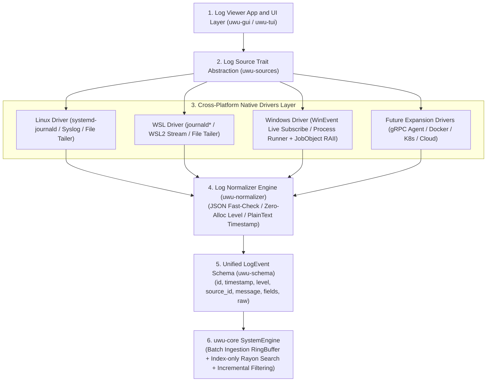
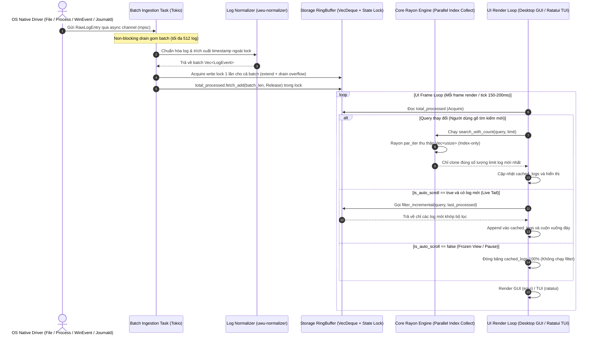
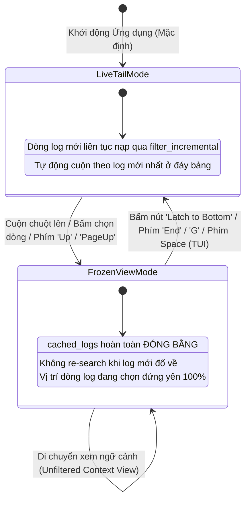

# Tài Liệu Kiến Trúc & Lộ Trình Phát Triển `uwu-log` (`archi.md`)

`uwu-log` là một công cụ xem và phân tích log thời gian thực (Real-time Log Viewer & Processor) siêu nhanh, hỗ trợ đa nền tảng (Windows, Linux, WSL, macOS) được thiết kế theo kiến trúc phân tầng chuẩn hóa (Layered Architecture) và động cơ lọc song song (Parallel Filtering Engine).

---

## 1. Triết Lý Kiến Trúc & Luồng Hoạt Động Cốt Lõi (Core Platform Architecture)

Kiến trúc tổng thể của `uwu-log` được xây dựng dựa trên nguyên tắc **Trích xuất Đa Nền Tảng ➔ Trừu Tượng Hóa Nguồn ➔ Chuẩn Hóa Dữ Liệu ➔ Động Cơ Lọc Song Song & Tăng Tiến**. Tất cả các nguồn log hiện tại lẫn các tính năng mở rộng trong tương lai **bắt buộc phải tuân theo luồng kiến trúc 4 tầng chuẩn này**:

```text
                  Log Viewer (uwu-gui / uwu-tui)
                              │
                       ┌──────┴──────┐
                       │ Log Source  │  (LogSource Trait Abstraction)
                       └──────┬──────┘
                              │
        ┌─────────────────────┼─────────────────────┬──────────────────┐
        ▼                     ▼                     ▼                  ▼
     Linux                   WSL                 Windows       (Mở rộng tương lai)
        │                     │                     │                  │
    journald              journald*          Event / Process     gRPC/Docker/K8s
        │                     │                     │                  │
        └─────────────────────┼─────────────────────┴──────────────────┘
                              ▼
                         Normalizer         (uwu-normalizer)
                              │
                              ▼
                          LogEvent          (uwu-schema chuẩn hóa)
                              │
                              ▼
                      Core System Engine    (uwu-core Storage RingBuffer & Rayon Engine)
```

---

### 1.1 Nguyên Tắc Trích Xuất Key Tự Động (Dynamic Key-Value Extraction / Zero-Rigid Schema)

`uwu-log` **không ép buộc bất kỳ schema cố định nào**. Mỗi ngôn ngữ (Go, Python, Node.js, Rust, C#) hoặc ứng dụng đều có kiểu khai báo key và cấu trúc log riêng. Động cơ `Normalizer` hoạt động theo nguyên tắc:

1. **Fast-Check & Trích xuất tự động 100% Key-Value**: Kiểm tra nhanh `{` / `[` để parse JSON (bao gồm cả trường của Systemd Journald), trích xuất động toàn bộ trường vào `fields: HashMap<String, serde_json::Value>`.
2. **Lọc Động Không Schema (Dynamic Field Query)**: Động cơ `uwu-core` cho phép người dùng gõ lệnh lọc theo **BẤT KỲ KEY NÀO** xuất hiện trong log (ví dụ: `user_id:user_123`, `latency > 500`, `status:500`, `region:"us-west-1"`) mà không cần định nghĩa trước schema.
3. **Giữ nguyên log thô (Raw Retention)**: Nội dung chuỗi log thô và mã màu ANSI luôn được bảo toàn nguyên vẹn để hiển thị sắc nét trên GUI / TUI.



---

### 1.2 Mô Hình Concurrency & Multi-Threading (Thread Model)

Mô hình xử lý bất đồng bộ phối hợp giữa **Tokio Async Runtime** (cho I/O thu thập log đa luồng) và **Rayon Parallel ThreadPool** (cho động cơ lọc log song song):



---

### 1.3 Sơ Đồ Trạng Thái Giao Diện (UI State Machine)

Sự chuyển đổi linh hoạt giữa chế độ **Live Tail** (cuộn tự động theo log mới) và **Frozen View** (đóng băng giao diện khi cuộn đọc log cũ hoặc click vào hàng log):



---

## 2. Chi Tiết Phân Tầng Các Module Hiện Tại (Current Component Architecture)

Hệ thống được tổ chức dạng **Cargo Workspace** gồm 3 crates chuẩn Idiomatic Rust:

| Crate | Đường Dẫn | Vai Trò & Các Tối Ưu Cốt Lõi |
| :--- | :--- | :--- |
| **`uwu-core`** | [`crates/core`](file:///D:/Learn/Go/uwulog-rust/crates/core) | **Thư Viện Logic Cốt Lõi**:<br/>• `schema`: Định nghĩa `LogLevel` (Unknown=0), `LogEvent`, `RawLogEntry`.<br/>• `sources`: Trừu tượng hóa driver `FileSource` (log rotation / truncate seek), `ProcessSource` (RAII JobObject & pipe drain), `WinEventSource` (`EvtSubscribe` live stream), `JournaldSource` (stderr drain & systemd field mapping).<br/>• `normalizer`: Fast-check JSON, trích xuất timestamp plain text, zero-allocation level detection.<br/>• `filter`: Động cơ lọc AST với Rayon song song.<br/>• `engine`: `SystemEngine` quản lý Batch Ingestion, RingBuffer `VecDeque`, Atomic Sequence và Incremental Filtering không race-condition. |
| **`uwu-gui`** | [`crates/gui`](file:///D:/Learn/Go/uwulog-rust/crates/gui) | **Tầng Giao Diện Desktop Native**:<br/>Ứng dụng Desktop UI (`eframe` / `egui`) hỗ trợ Auto-scroll, Incremental Live Filtering, Dynamic Key Discovery, Unfiltered Snapshot Context, Autocomplete, History, DWM Dark Title Bar. |
| **`uwu-tui`** | [`crates/tui`](file:///D:/Learn/Go/uwulog-rust/crates/tui) | **Tầng Giao Diện Terminal UI**:<br/>Ứng dụng Terminal UI (`ratatui`) hỗ trợ Live Tail, Frozen View, ô tìm kiếm cú pháp đầy đủ và phím tắt điều hướng nhanh. |

---

## 3. Nguyên Tắc Mở Rộng Tính Năng Tương Lai (Future Architecture Expansion)

Mọi tính năng mở rộng trong tương lai **bắt buộc phải tuân theo giao thức phân tầng**:

```text
       ┌────────────────────────────────────────────────────────┐
       │             Future Expansion Source Drivers            │
       └──────────────────────────┬─────────────────────────────┘
                                  │
       ┌──────────────────────────┴─────────────────────────────┐
       ▼                                                        ▼
[Remote gRPC / Protobuf]                             [Docker Container API]
       │                                                        │
[CloudWatch / Loki Agent]                            [Kubernetes Pod Stream]
       │                                                        │
       └──────────────────────────┬─────────────────────────────┘
                                  ▼
                     LogSource Trait Abstraction
                                  │
                                  ▼
                         uwu-normalizer
                                  │
                                  ▼
                         Unified LogEvent
                                  │
                                  ▼
                         uwu-core Storage
```

### 🚀 Lộ Trình Phát Triển Chi Tiết:

#### 🐧 Giai Đoạn 1: Native Linux & WSL `journald` Driver
- **Trạng thái**: ✅ **ĐÃ HOÀN THÀNH (Implemented)**
- **Hiện thực**: `JournaldSource` impl `LogSource` trait, stream trực tiếp qua `journalctl -f -o json`, drain stderr chống deadlock và chuẩn hóa các trường đặc thù của systemd (`PRIORITY`, `__REALTIME_TIMESTAMP`, `MESSAGE`).

#### 💻 Giai Đoạn 2: Desktop Native GUI
- **Trạng thái**: ✅ **ĐÃ HOÀN THÀNH (Implemented)**
- **Hiện thực**: `crates/gui` xây dựng trên nền `eframe` / `egui` (Pure Rust), tích hợp trực tiếp `SystemEngine` với Live Incremental Filtering, Unfiltered View ngữ cảnh lỗi và tùy biến hiển thị cột động.

#### 📡 Giai Đoạn 3: Remote Log Agent & Distributed Streaming
- **Mục tiêu**: Hỗ trợ thu thập log từ xa qua mạng bảo mật không làm nghẽn I/O.
- **Tính năng**: `gRPC / WebSockets Collector Agent` đẩy log nén real-time từ remote server/container về `uwu-log`.
- **Tích hợp**: Cài đặt `GrpcSource` impl `LogSource` trait ➔ Đẩy `RawLogEntry` vào `uwu-normalizer`.

#### 💾 Giai Đoạn 4: Lưu Trữ Đĩa Cứng High-Performance (Columnar Persistence & Indexing)
- **Mục tiêu**: Ghi log xuống đĩa dạng nén cột (Parquet / DuckDB / mmap) và đánh chỉ mục bằng Roaring Bitmaps để truy vấn hàng chục triệu log mà không làm tràn RAM.
- **Tích hợp**: Đặt phía sau `SystemEngine` Ingestion Pipeline làm tầng lưu trữ thứ cấp (Cold Storage).

#### 📊 Giai Đoạn 5: Analytics, Log Rate Histogram & Alerting System
- **Mục tiêu**: Vẽ biểu đồ tần suất log (Log Rate Histogram) và tự động phát cảnh báo qua Telegram, Slack, Webhook khi phát hiện đột biến lỗi (`ERROR`/`CRITICAL` spike).
