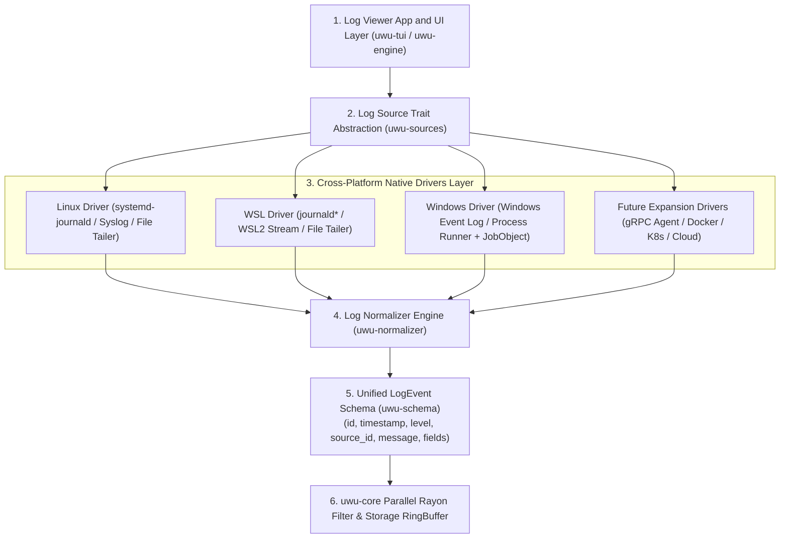
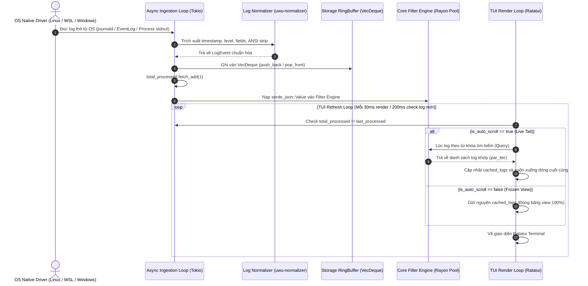
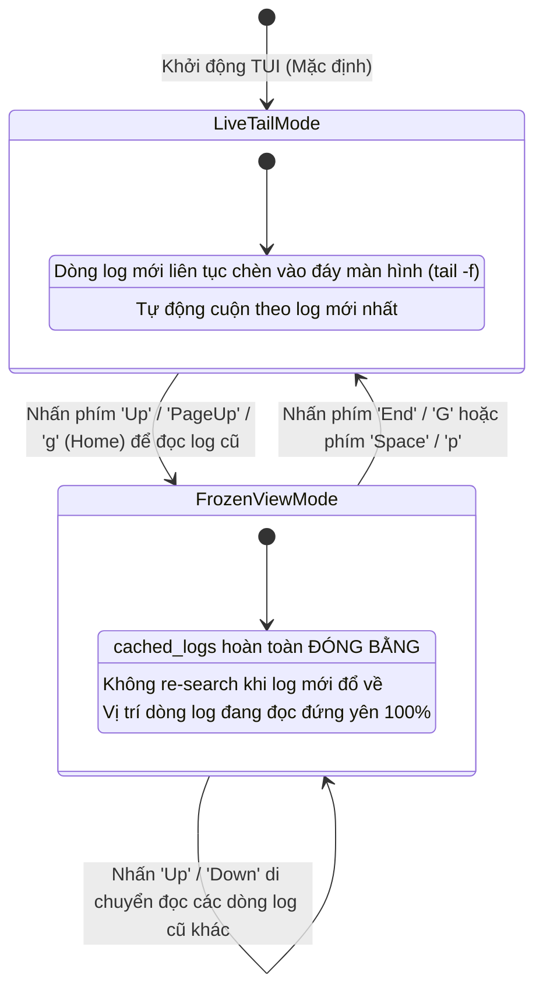

# Tài Liệu Kiến Trúc & Lộ Trình Phát Triển `uwu-log` (`archi.md`)

`uwu-log` là một công cụ xem và phân tích log thời gian thực (Real-time Log Viewer & Processor) siêu nhanh, hỗ trợ đa nền tảng (Windows, Linux, WSL, macOS) được thiết kế theo kiến trúc phân tầng chuẩn hóa (Layered Architecture) và động cơ lọc song song (Parallel Filtering Engine).

---

## 1. Triết Lý Kiến Trúc & Luồng Hoạt Động Cốt Lõi (Core Platform Architecture)

Kiến trúc tổng thể của `uwu-log` được xây dựng dựa trên nguyên tắc **Trích xuất Đa Nền Tảng ➔ Trừu Tượng Hóa Nguồn ➔ Chuẩn Hóa Dữ Liệu ➔ Động Cơ Lọc Song Song**. Tất cả các nguồn log hiện tại lẫn các tính năng mở rộng trong tương lai **bắt buộc phải tuân theo luồng kiến trúc 4 tầng chuẩn này**:

```text
                  Log Viewer (uwu-tui / uwu-engine)
                      │
               ┌──────┴──────┐
               │ Log Source  │  (LogSource Trait Abstraction)
               └──────┬──────┘
                      │
       ┌──────────────┼──────────────┬──────────────────┐
       ▼              ▼              ▼                  ▼
    Linux           WSL           Windows       (Mở rộng tương lai)
       │              │              │                  │
   journald       journald*      Event Log       gRPC/Docker/K8s
       │              │              │                  │
       └──────────────┼──────────────┴──────────────────┘
                      ▼
                 Normalizer     (uwu-normalizer)
                      │
                      ▼
                  LogEvent      (uwu-schema chuẩn hóa)
                      │
                      ▼
              Core Filter Engine (uwu-core Rayon Engine)
```

---

### 1.1 Nguyên Tắc Trích Xuất Key Tự Động (Dynamic Key-Value Extraction / Zero-Rigid Schema)

`uwu-log` **không ép buộc bất kỳ schema cố định nào**. Mỗi ngôn ngữ (Go, Python, Node.js, Rust, C#) hoặc ứng dụng đều có kiểu khai báo key và cấu trúc log riêng. Động cơ `Normalizer` hoạt động theo nguyên tắc:

1. **Trích xuất tự động 100% Key-Value**: Tất cả các trường dữ liệu có trong log (JSON, XML, Key-Value text) đều được trích xuất động vào mảng `fields: HashMap<String, serde_json::Value>`.
2. **Lọc Động Không Schema (Dynamic Field Query)**: Động cơ `uwu-core` cho phép người dùng gõ lệnh lọc theo **BẤT KỲ KEY NÀO** xuất hiện trong log (ví dụ: `user_id:user_123`, `latency > 500`, `status:500`, `region:"us-west-1"`) mà không cần định nghĩa trước schema.
3. **Giữ nguyên log thô (Raw Retention)**: Nội dung chuỗi log thô và mã màu ANSI luôn được bảo toàn nguyên vẹn để hiển thị sắc nét trên TUI.



---

### 1.2 Mô Hình Concurrency & Multi-Threading (Thread Model)

Mô hình xử lý bất đồng bộ phối hợp giữa **Tokio Async Runtime** (cho I/O thu thập log) và **Rayon Parallel ThreadPool** (cho động cơ lọc log):



---

### 1.3 Sơ Đồ Trạng Thái Giao Diện (TUI State Machine)

Sự chuyển đổi linh hoạt giữa chế độ **Live Tail** (cuộn tự động theo log mới) và **Frozen View** (đóng băng giao diện khi cuộn đọc log cũ):



---

## 2. Chi Tiết Phân Tầng Các Module Hiện Tại (Current Component Architecture)

Hệ thống được tổ chức dạng **Cargo Workspace** gồm 6 crates phân tầng rõ ràng:

| Crate | Đường Dẫn | Vai Trò & Tầng Kiến Trúc |
| :--- | :--- | :--- |
| **`uwu-schema`** | [`crates/schema`](file:///D:/Learn/Go/uwulog-rust/crates/schema) | **Tầng Schema Chuẩn Hóa**: Định nghĩa cấu trúc `LogEvent`, `LogLevel`, `RawLogEntry`, `RawPayload`. |
| **`uwu-sources`** | [`crates/sources`](file:///D:/Learn/Go/uwulog-rust/crates/sources) | **Tầng Driver Đa Nền Tảng**: Định nghĩa `LogSource` Trait và các Driver (`WinEventSource`, `ProcessSource` với Windows JobObject, `FileSource`). |
| **`uwu-normalizer`** | [`crates/normalizer`](file:///D:/Learn/Go/uwulog-rust/crates/normalizer) | **Tầng Chuẩn Hóa**: Chuyển đổi log thô (JSON, Windows Event XML, Plaintext ANSI strip) về `LogEvent`. |
| **`uwu-core`** | [`crates/filter`](file:///D:/Learn/Go/uwulog-rust/crates/filter) | **Tầng Động Cơ Lọc Song Song**: Động cơ Rayon Parallel ThreadPool + Parser biểu thức logic boolean/regex. |
| **`uwu-engine`** | [`crates/engine`](file:///D:/Learn/Go/uwulog-rust/crates/engine) | **Tầng Pipeline Bất Đồng Bộ**: Tokio MPSC Channels, In-memory `VecDeque` RingBuffer, bộ đếm `AtomicU64 total_processed`. |
| **`uwu-tui`** | [`crates/tui`](file:///D:/Learn/Go/uwulog-rust/crates/tui) | **Tầng Giao Diện Người Dùng**: Ứng dụng Terminal UI (`ratatui`) hỗ trợ Live Tail, Frozen View, ô tìm kiếm và phím tắt điều hướng. |

---

## 3. Nguyên Tắc Mở Rộng Tính Năng Tương Lai (Future Architecture Expansion)

Mọi tính năng mở rộng trong tương lai **đều phải tích hợp theo đúng tầng kiến trúc chuẩn**:

```text
       ┌────────────────────────────────────────────────────────┐
       │             Future Expansion Source Drivers            │
       └──────────────────────────┬─────────────────────────────┘
                                  │
       ┌──────────────────────────┴─────────────────────────────┐
       ▼                                                        ▼
[Remote gRPC / Protobuf]                             [Docker Container API]
       │                                                        │
[Linux systemd-journald]                             [Kubernetes Pod Stream]
       │                                                        │
       └──────────────────────────┬─────────────────────────────┘
                                  ▼
                    LogSource Trait Abstraction
                                  │
                                  ▼
                         uwu-normalizer
                                  │
                                  ▼
                         Unified LogEvent
```

### 🚀 Lộ Trình Phát Triển Chi Tiết:

#### 🐧 Giai Đoạn 1: Native Linux & WSL `journald` Driver
- **Mục tiêu**: Hoàn thiện Driver lắng nghe trực tiếp từ `systemd-journald` trên Linux & WSL2 (`journalctl -f --output=json`).
- **Tích hợp**: Cài đặt `JournaldSource` impl `LogSource` trait ➔ Đẩy `RawLogEntry` vào `uwu-normalizer`.

#### 💻 Giai Đoạn 2: Desktop GUI & Visual Dashboards
- **Mục tiêu**: Xây dựng giao diện ứng dụng Desktop Native (bên cạnh TUI hiện tại).
- **Công nghệ dự kiến**: `Tauri` (Rust Core + Frontend HTML/JS) hoặc `iced` / `Egui` (Pure Rust GUI).
- **Tích hợp**: Đọc trực tiếp dữ liệu chuẩn hóa `LogEvent` từ `uwu-engine` RingBuffer & `uwu-core` Filter Engine.

#### 📡 Giai Đoạn 3: Remote Log Agent & Distributed Streaming
- **Mục tiêu**: Hỗ trợ thu thập log từ xa qua mạng bảo mật.
- **Tính năng**: `gRPC / WebSockets Collector Agent` đẩy log nén real-time từ remote server về `uwu-log`.
- **Tích hợp**: Cài đặt `GrpcSource` impl `LogSource` trait ➔ Đẩy vào `uwu-normalizer`.

#### 💾 Giai Đoạn 4: Lưu Trữ Đĩa Cứng High-Performance (Columnar Persistence & Indexing)
- **Mục tiêu**: Ghi log xuống đĩa dạng nén cột (Parquet / DuckDB) và đánh chỉ mục bằng Roaring Bitmaps để truy vấn hàng chục triệu log mà không cạn RAM.

#### 📊 Giai Đoạn 5: Analytics, Log Rate Histogram & Alerting System
- **Mục tiêu**: Vẽ biểu đồ tần suất log (Log Rate Histogram) và tự động phát cảnh báo qua Telegram, Slack, Webhook khi phát hiện lỗi hệ thống (`ERROR`/`CRITICAL` spike).
