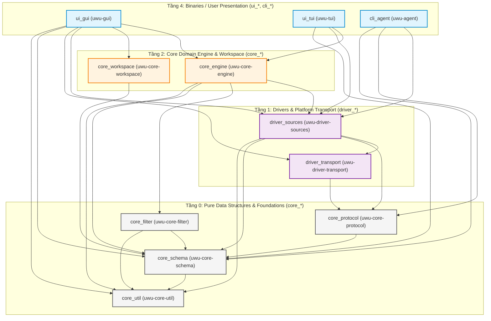
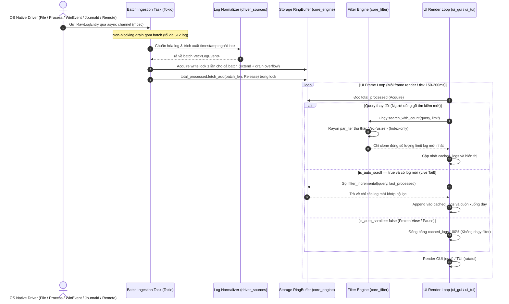

# Tài Liệu Kiến Trúc & Lộ Trình Phát Triển `uwu-log` (`archi.md`)

`uwu-log` là một công cụ xem và phân tích log thời gian thực (Real-time Log Viewer & Processor) siêu nhanh, hỗ trợ đa nền tảng (Windows, Linux, WSL, macOS) được thiết kế theo **kiến trúc đồ thị có hướng không chu trình 5 tầng phân cấp (5-Tier DAG Multi-Crate Architecture)** lấy cảm hứng từ Zed Editor (`sum_tree`, `text`, `gpui`), đảm bảo luồng phụ thuộc đơn chiều (Top-down One-Way Dependency), thời gian biên dịch cực nhanh và tính cô lập hoàn toàn giữa các thành phần.

---

## 1. Sơ Đồ Kiến Trúc Đồ Thị Phân Cấp 5 Tầng (5-Tier DAG Multi-Crate Architecture)

Toàn bộ hệ thống `uwu-log` được chia tách phẳng trong thư mục `crates/` thành 11 crates độc lập với tiền tố phân loại kỹ thuật rõ ràng:

---

## 2. Bảng Phân Tầng & Danh Mục Crates

| Tầng | Crate | Package Name | Thư Mục | Vai Trò Kỹ Thuật | Phụ Thuộc (Dependencies) |
| :--- | :--- | :--- | :--- | :--- | :--- |
| **Tier 4** | `ui_gui` | `uwu-ui-gui` | [`crates/ui_gui`](file:///D:/Learn/Go/uwulog-rust/crates/ui_gui) | Binary `uwu-gui`: Giao diện Desktop GUI (`egui`/`eframe`), Virtual Scrolling, Live Tail, Context Inspector, Autocomplete | `core_engine`, `core_workspace`, `driver_sources`, `driver_transport`, `core_schema`, `core_util` |
| **Tier 4** | `ui_tui` | `uwu-ui-tui` | [`crates/ui_tui`](file:///D:/Learn/Go/uwulog-rust/crates/ui_tui) | Binary `uwu-tui`: Giao diện Terminal UI (`ratatui`), Live Tail, Keybindings, Fast Navigation | `core_engine`, `driver_sources`, `core_schema` |
| **Tier 4** | `cli_agent` | `uwu-cli-agent` | [`crates/cli_agent`](file:///D:/Learn/Go/uwulog-rust/crates/cli_agent) | Binary `uwu-agent`: Headless daemon thu thập log trên remote server/WSL/container qua giao thức stdio framing | `driver_sources`, `core_protocol`, `core_schema` |
| **Tier 2** | `core_engine` | `uwu-core-engine` | [`crates/core_engine`](file:///D:/Learn/Go/uwulog-rust/crates/core_engine) | `SystemEngine`: Quản lý Tokio Ingestion Pipeline, RingBuffer `VecDeque`, Rayon Parallel Index-only Filter, Incremental Filter | `driver_sources`, `core_filter`, `core_schema`, `core_util` |
| **Tier 2** | `core_workspace` | `uwu-core-workspace` | [`crates/core_workspace`](file:///D:/Learn/Go/uwulog-rust/crates/core_workspace) | Quản lý dự án, cấu hình session, lưu trữ `workspaces.json` đa môi trường (Local / WSL) | `core_schema` |
| **Tier 1** | `driver_sources` | `uwu-driver-sources` | [`crates/driver_sources`](file:///D:/Learn/Go/uwulog-rust/crates/driver_sources) | Các driver nguồn log: `FileSource`, `ProcessSource`, `JournaldSource`, `WinEventSource`, `WslSource`, `RemoteSource`, `LogNormalizer` | `driver_transport`, `core_protocol`, `core_schema`, `core_util` |
| **Tier 1** | `driver_transport` | `uwu-driver-transport` | [`crates/driver_transport`](file:///D:/Learn/Go/uwulog-rust/crates/driver_transport) | Giao thức truyền tải proxy từ xa (`RemoteTransport` trait, `WslTransport`, `SshTransport`, `ProcessTransport`) | `core_protocol` |
| **Tier 0** | `core_filter` | `uwu-core-filter` | [`crates/core_filter`](file:///D:/Learn/Go/uwulog-rust/crates/core_filter) | Bộ phân tích cú pháp AST (`tokenize`, `Parser`, `Expr`), Zero-alloc Dynamic Event Evaluator (`eval_event`) | `core_schema`, `core_util` |
| **Tier 0** | `core_protocol` | `uwu-core-protocol` | [`crates/core_protocol`](file:///D:/Learn/Go/uwulog-rust/crates/core_protocol) | Giao thức framed envelope nhị phân 2 chiều (`ClientEnvelope`, `ServerEnvelope`, `FramedReader`, `FramedWriter`) | `core_schema` |
| **Tier 0** | `core_schema` | `uwu-core-schema` | [`crates/core_schema`](file:///D:/Learn/Go/uwulog-rust/crates/core_schema) | Định nghĩa các cấu trúc dữ liệu cốt lõi: `LogEvent`, `LogLevel`, `RawPayload`, `RawLogEntry` | `core_util` |
| **Tier 0** | `core_util` | `uwu-core-util` | [`crates/core_util`](file:///D:/Learn/Go/uwulog-rust/crates/core_util) | Tiện ích zero-alloc: `strip_ansi`, `contains_ignore_case`, `parse_iso_to_secs`, `parse_numeric_value` | Không phụ thuộc crate nội bộ |

---

## 3. Triết Lý Thiết Kế Cốt Lõi (Core Principles)

1. **Đơn Chiều Tuyệt Đối (Strict 1-Way DAG)**: Mối quan hệ phụ thuộc chỉ chảy từ tầng trên xuống tầng dưới (Tier 4 ➔ Tier 2 ➔ Tier 1 ➔ Tier 0). Không bao giờ có phụ thuộc vòng (Circular Dependency) hoặc phụ thuộc ngược.
2. **Tiền Tố Đàng Hoàng & Tự Giải Thích (Explicit Prefix Taxonomy)**:
   - `core_*`: Thuật toán thuần túy, mô hình dữ liệu, bộ máy xử lý (Pure logic, data structures, engines).
   - `driver_*`: Giao tiếp phần cứng, hệ điều hành, I/O, mạng, IPC (OS, I/O, network, transport drivers).
   - `ui_*`: Giao diện người dùng đồ họa hoặc terminal (Presentation layer).
   - `cli_*`: Công cụ dòng lệnh hoặc daemon headless (Command-line binaries).
3. **Không Có Thùng Rác / Tầng Giả Tạo**: Mỗi crate có ranh giới rõ ràng, không sử dụng facade crate hay umbrella package che giấu phụ thuộc.
4. **Hiệu Suất Zero-Allocation**: Xử lý chuỗi (ANSI, substring, casing) và đánh giá biểu thức lọc hạn chế tối đa việc cấp phát bộ nhớ heap không cần thiết.
5. **Độc Lập Biên Dịch Song Song**: Các crate ở Tier 0 và Tier 1 có thể được compiler Rust biên dịch hoàn toàn song song (Parallel Compilation), rút ngắn tối đa thời gian build.

---

## 4. Mô Hình Concurrency & Multi-Threading (Thread Model)

Mô hình xử lý bất đồng bộ phối hợp giữa **Tokio Async Runtime** (cho I/O thu thập log đa luồng) và **Rayon Parallel ThreadPool** (cho động cơ lọc log song song):

---

## 5. Lộ Trình Phát Triển Chi Tiết (Roadmap)

### 🐧 Giai Đoạn 1: Native Linux & WSL `journald` Driver
- **Trạng thái**: ✅ **ĐÃ HOÀN THÀNH (Implemented)**
- **Hiện thực**: `JournaldSource` impl `LogSource` trait, stream trực tiếp qua `journalctl -f -o json`, drain stderr chống deadlock và chuẩn hóa các trường đặc thù của systemd (`PRIORITY`, `__REALTIME_TIMESTAMP`, `MESSAGE`).

### 💻 Giai Đoạn 2: Desktop Native GUI & TUI
- **Trạng thái**: ✅ **ĐÃ HOÀN THÀNH (Implemented)**
- **Hiện thực**: `crates/ui_gui` xây dựng trên nền `eframe` / `egui`, `crates/ui_tui` trên nền `ratatui`, tích hợp trực tiếp `SystemEngine` với Live Incremental Filtering, Unfiltered View ngữ cảnh lỗi và tùy biến hiển thị cột động.

### 📡 Giai Đoạn 3: Remote Log Agent & Distributed Streaming
- **Trạng thái**: ✅ **ĐÃ HOÀN THÀNH (Implemented)**
- **Hiện thực**: `crates/cli_agent` (`uwu-agent`), `crates/core_protocol` (Framed RPC), `crates/driver_transport` (`WslTransport`, `SshTransport`, `ProcessTransport`), `crates/driver_sources/src/remote.rs` (`RemoteSource`).

### 💾 Giai Đoạn 4: Lưu Trữ Đĩa Cứng High-Performance (Columnar Persistence & Indexing)
- **Mục tiêu**: Ghi log xuống đĩa dạng nén cột (Parquet / DuckDB / mmap) và đánh chỉ mục bằng Roaring Bitmaps để truy vấn hàng chục triệu log mà không làm tràn RAM.
- **Tích hợp**: Đặt phía sau `core_engine` Ingestion Pipeline làm tầng lưu trữ thứ cấp (Cold Storage).

### 📊 Giai Đoạn 5: Analytics, Log Rate Histogram & Alerting System
- **Mục tiêu**: Vẽ biểu đồ tần suất log (Log Rate Histogram) và tự động phát cảnh báo qua Telegram, Slack, Webhook khi phát hiện đột biến lỗi (`ERROR`/`CRITICAL` spike).
