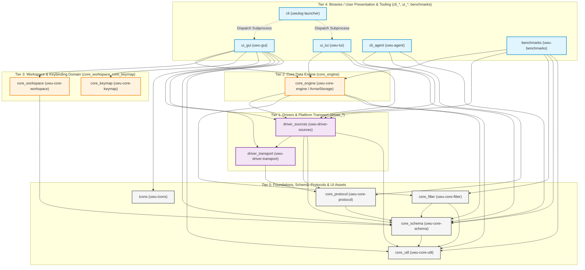
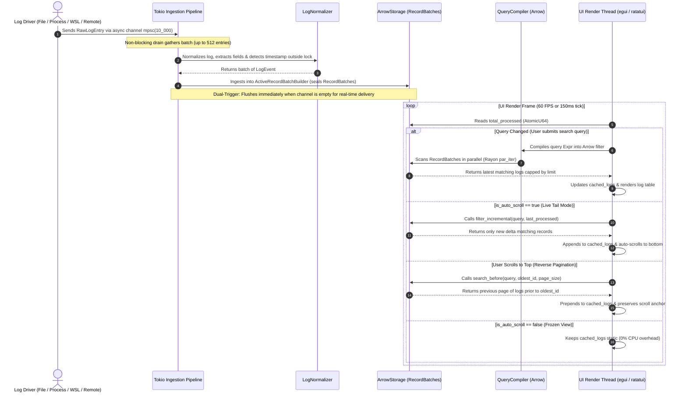

# Architecture & Development Roadmap: `uwu-log` (`archi.md`)

`uwu-log` is an ultra-fast, cross-platform real-time log viewer and processor (supporting Windows, Linux, WSL, and macOS) engineered with a **5-Tier Directed Acyclic Graph (DAG) Multi-Crate Architecture** inspired by Zed Editor (`sum_tree`, `gpui`, and Zed Keymap engine) and powered by an **in-memory Apache Arrow columnar engine**. This architecture guarantees a strict top-down, one-way dependency flow, optimal parallel compilation times, and microsecond-level query latencies.

---

## 1. 5-Tier DAG Multi-Crate Architecture Diagram

The system is modularized into **15 decoupled crates** under [`crates/`](file:///home/truongviet/projects/uwulog-rust/crates) with explicit classification prefixes:



---

## 2. In-Memory Columnar Pipeline & Transport Architecture

Log records originating from **WSL, Windows, Linux, and Remote Servers** are ingested, processed, and rendered following this stream model:
**OS Pipes / I/O ➔ Tokio Channel ➔ Normalizer ➔ Apache Arrow Columnar Chunks ➔ Vectorized Query Compiler ➔ UI Render**:

```
┌───────────────────────────────────────────────────────────┐
│ Windows / Linux Local Process                             │
│ (stdout/stderr) ───[ Anonymous Pipe: Stdio::piped() ]────┐│
└───────────────────────────────────────────────────────────┼┘
┌───────────────────────────────────────────────────────────┤
│ Local Log File                                            │
│ (Disk File)     ───[ Non-blocking File I/O + Seek ]──────┤│
└───────────────────────────────────────────────────────────┼┘
┌───────────────────────────────────────────────────────────┤
│ WSL (Linux kernel on Windows)                             │
│ (wsl.exe)       ───[ Windows <-> WSL Bridge Pipe ]────────┤│
└───────────────────────────────────────────────────────────┼┘
┌───────────────────────────────────────────────────────────┤
│ Remote Server / Container                                 │
│ (uwu-agent)     ───[ SSH / StdIn-StdOut Framed RPC ]──────┘│
└───────────────────────────────────────────────────────────┘
                               │
                               ▼
               [ Tokio Async Channel mpsc(10_000) ]
                               │
                               ▼
             [ Batch Normalizer & Adaptive Timestamp ]
          (Extracts JSON/Text outside lock, adaptive format)
                               │
                               ▼
        [ ArrowStorage: ActiveRecordBatchBuilder (core_engine) ]
          (Packs columns: __id, __color, __timestamp, __message, dynamic)
                               │
                               ▼
             [ Sealed Apache Arrow RecordBatch Chunks ]
        (Columnar Memory, FIFO RingBuffer Eviction per capacity)
                               │
                               ▼
          [ QueryCompiler + Rayon Vectorized Execution ]
     (Compiles Expr AST directly into boolean filter masks on Arrow arrays)
                               │
                               ▼
                   [ UI Thread Render Loop ]
       (Live Tail / Reverse Pagination / Unfiltered Context / Frozen View)
```

### 2.1. Ingestion & OS Transport Layer
1. **Host Subprocess ([`ProcessSource`](file:///home/truongviet/projects/uwulog-rust/crates/driver_sources/src/process.rs))**:
   - Spawned using `tokio::process::Command` with `Stdio::piped()`. Stream lines are consumed asynchronously via `tokio::io::BufReader`.
   - On Windows: Associated with a **Windows Job Object** to guarantee atomic cleanup of the entire child process tree upon termination.
2. **WSL Subprocess Bridge ([`WslSource`](file:///home/truongviet/projects/uwulog-rust/crates/driver_sources/src/wsl.rs) & [`WslTransport`](file:///home/truongviet/projects/uwulog-rust/crates/driver_transport/src/wsl.rs))**:
   - Executes `wsl.exe -d <distro> --cd <dir> -- <cmd>` through anonymous pipes with zero networking overhead.
   - Distributed streaming mode: Automatically transfers [`uwu-agent`](file:///home/truongviet/projects/uwulog-rust/crates/cli_agent/src/main.rs) into WSL, communicating via bidirectional **Framed Binary Envelopes**.
3. **Remote Server over SSH ([`RemoteSource`](file:///home/truongviet/projects/uwulog-rust/crates/driver_sources/src/remote.rs) + [`SshTransport`](file:///home/truongviet/projects/uwulog-rust/crates/driver_transport/src/ssh.rs))**:
   - Establishes an encrypted SSH tunnel transmitting structured binary packets defined by [`core_protocol`](file:///home/truongviet/projects/uwulog-rust/crates/core_protocol).
4. **Local File Tailer ([`FileSource`](file:///home/truongviet/projects/uwulog-rust/crates/driver_sources/src/file_tailer.rs))**:
   - Non-blocking asynchronous file tailing with real-time detection of file truncation and file rotation.

### 2.2. Apache Arrow Storage & Vectorized Query Engine ([`core_engine`](file:///home/truongviet/projects/uwulog-rust/crates/core_engine))
Instead of holding fragmented heap objects in linked structures (`VecDeque<LogEvent>`), `core_engine` stores data in **Apache Arrow Columnar Chunks**:
1. **`ActiveRecordBatchBuilder`**:
   - Accumulates incoming records into strongly typed Arrow array builders (`UInt64Array`, `UInt8Array`, `StringArray`, `Float64Array`).
   - Employs a **Dual-Trigger** flush strategy: automatically seals a chunk when capacity threshold is met OR when the ingest channel `raw_rx` becomes empty, guaranteeing sub-millisecond real-time UI delivery.
2. **Zero-Lookup `BatchColumns` Cache**:
   - Pre-extracts raw array references for standard columns (`__id`, `__color`, `__timestamp`, `__message`) and dynamic field offsets once per `RecordBatch`, eliminating repetitive schema hashmap lookups during scan loops.
3. **`QueryCompiler`**:
   - Compiles AST query expressions ([`Expr`](file:///home/truongviet/projects/uwulog-rust/crates/core_filter/src/parser.rs)) into vectorized predicate evaluations directly over Arrow column arrays, generating `BooleanArray` masks evaluated in parallel across CPU cores using Rayon.
4. **Reverse Pagination & Context Inspection**:
   - [`search_before`](file:///home/truongviet/projects/uwulog-rust/crates/core_engine/src/lib.rs#L263): Efficiently queries older records immediately preceding `before_id` to power infinite upward scroll.
   - [`get_unfiltered_events`](file:///home/truongviet/projects/uwulog-rust/crates/core_engine/src/lib.rs#L293): Retrieves a raw context window around any selected error record without requiring filter re-evaluation.

---

## 3. Concurrency Model & UI Interaction (Sequence Flow)



---

## 4. Core Architectural Principles

1. **Strict 1-Way DAG**: Dependencies flow strictly top-down (Tier 4 ➔ Tier 3 ➔ Tier 2 ➔ Tier 1 ➔ Tier 0). Circular or reverse dependencies are strictly forbidden.
2. **Explicit Taxonomy**:
   - `core_*`: Pure logic, data models, storage engines, and domain management.
   - `driver_*`: OS interactions, process I/O, network tunnels, and transport drivers.
   - `ui_*`: Presentation layer (Native Desktop GUI & Terminal TUI).
   - `cli_*`: Command-line launchers and headless collection daemons.
3. **Columnar In-Memory Efficiency**: Apache Arrow powers the core data pipeline, minimizing heap allocations, maximizing CPU L1/L2 cache locality, and accelerating filtering via SIMD/Rayon.
4. **Zero-Allocation & SSOT Schema**: `StandardField` acts as the Single Source of Truth for aliases (`timestamp`, `level`, `message`, `id`). `LogFields` uses a flat vector representation to eliminate bucket allocation overhead.
5. **Zed-Style Modern UX**: 4-layer hierarchical keybindings manager (`core_keymap`), themeable UI registry (`ui_gui/theme`), and standardized vector SVG icons (`icons`).

---

## 5. Development Roadmap

### 🧩 Phase 1: Single Source of Truth Schema & High-Performance Normalizer
- **Status**: ✅ **COMPLETED**
- **Deliverables**: `StandardField` unifying semantic fields, `LogNormalizer` providing fast JSON/text extraction, and adaptive timestamp inference (`core_util`).

### 💻 Phase 2: Desktop Native GUI & Terminal TUI
- **Status**: ✅ **COMPLETED**
- **Deliverables**: `crates/ui_gui` (`egui`/`eframe`) and `crates/ui_tui` (`ratatui`), featuring smooth virtual scrolling, live tailing, and unfiltered error context views.

### 📡 Phase 3: Remote Log Agent & Distributed Streaming
- **Status**: ✅ **COMPLETED**
- **Deliverables**: Standalone `uwu-agent` binary, `core_protocol` Framed Envelopes, and unified transport adapters (`WslTransport`, `SshTransport`, `ProcessTransport`).

### 🚀 Phase 4: Apache Arrow Columnar Engine & Reverse Pagination
- **Status**: ✅ **COMPLETED**
- **Deliverables**: Replaced `VecDeque` with `ArrowStorage`, implemented `ActiveRecordBatchBuilder`, `QueryCompiler`, and bidirectional reverse pagination (`search_before`).

### ⌨️ Phase 5: Zed-Style Keybindings, Vector Icons & Universal CLI Launcher
- **Status**: ✅ **COMPLETED**
- **Deliverables**:
  - `crates/core_keymap`: 4-layer hierarchical keybindings engine customizable via `keymap.json`.
  - `crates/icons`: Vector SVG icon paint components.
  - `crates/cli`: Universal `uwulog` launcher executable with intelligent companion subprocess forwarding.

### 💾 Phase 6: Columnar Disk Persistence
- **Goal**: Persist logs to disk using compressed Parquet or columnar formats indexed with Roaring Bitmaps, enabling fast queries across multi-gigabyte log archives without RAM exhaustion.
- **Integration**: Secondary cold storage tier operating behind `ArrowStorage`.

### 📊 Phase 7: Real-Time Analytics, Log Rate Histogram & Alerting System
- **Goal**: Real-time log frequency visualization (Log Rate Histogram) and automated notifications via Webhook/Slack/Telegram upon anomaly detection or error spikes (`ERROR`/`CRITICAL`).
